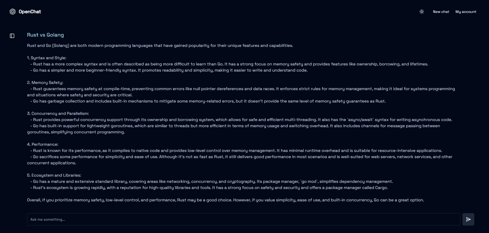

This is a [MERN](https://nextjs.org/) project bootstrapped with [`create-next-app`](https://github.com/vercel/next.js/tree/canary/packages/create-next-app).

## Getting Started

First, run the development server:

```bash
npm run dev


Open [http://localhost:3000](http://localhost:3000) with your browser to see the result.


## Tech

- Mern 
- OpenAI

## Preview





